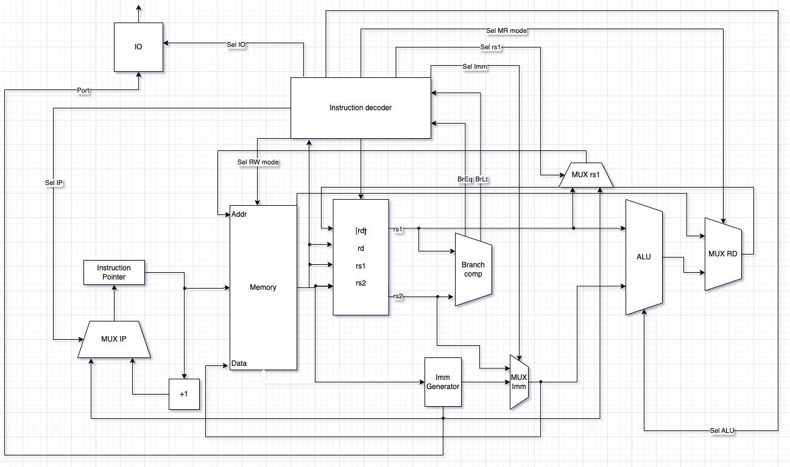

# ASM-like. Транслятор и модель

Вариант: 
```
asm | risc | neum | hw | instr | binary | stream | port | prob1
```

| Особенности             |                                                                     |
|-------------------------|---------------------------------------------------------------------|
| ЯП. Синтаксис           | Синтаксис ассемблера. Поддержка меток (labels).                     |
| Архитектура             | Система команд должна быть упрощенной, в духе RISC архитектур.      |
| Организация памяти      | Архитектура фон Неймана.                                            |
| Control Unit            | hardwired. Реализуется как часть модели.                            |
| Точность модели         | Процессор необходимо моделировать с точностью до каждой инструкции. |
| Представление маш. кода | Бинарное представление.                                             |
| Ввод-вывод              | Ввод-вывод осуществляется как поток токенов.                        |
| Ввод-вывод ISA          | Port-mapped                                                         |
| Алгоритм                | Сумма всех чисел кратных 3 или 5 ниже 1000.                         |


## Язык программирования

Описание синтаксиса:
```text
<program> ::= 
        "section data:" <whitespace>* <data_section>?
        <whitespace> 
        "section text:" <whitespace>* <instruction_section>?
<data_section> ::= <data> (<whitespace> <data>)*
<data> ::= (<label_declaration>) " "* (<char_literal> | <number>) ("," (<char_literal> | <number>))*
<instruction_section> ::= <instruction> (<whitespace> <instruction>)*
<instruction> ::= (<label_declaration>)? " "* <letter>+ (" " (<address>  | (<reg> "," <address>) | (<reg> "," <reg> "," <address>)))? 
<address> ::= <number> | <label>
<reg> ::= "x" <number>
<label_declaration> ::= <label> ":"
<label> ::= <letter> (<letter>|<digit>)*
<char_literal> ::= "'" (<letter> | <digit> | <whitespace>)+ "'"
<letter> ::= "A" | "B" | "C" | "D" | "E" | "F" | "G"
       | "H" | "I" | "J" | "K" | "L" | "M" | "N"
       | "O" | "P" | "Q" | "R" | "S" | "T" | "U"
       | "V" | "W" | "X" | "Y" | "Z" | "a" | "b"
       | "c" | "d" | "e" | "f" | "g" | "h" | "i"
       | "j" | "k" | "l" | "m" | "n" | "o" | "p"
       | "q" | "r" | "s" | "t" | "u" | "v" | "w"
       | "x" | "y" | "z"
<whitespace> ::= " " | "\n" | "\t"
<number> ::= <digit> | ( [1-9] <digit>+ )
<digit> ::= [0-9]

```


В программе должны быть две обязательные секции - для данных (может быть пустой) и для кода - `section data:` и `section text:` соответственно

**Поддерживаются метки**.
Метка - это символьное имя, обозначающее ячейку памяти, которая содержит некоторую команду или данные. Метка обязана начинаться с строчной или прописной буквы, кроме того, может содержать в своём имени цифры.

- В секции данных после метки следуют значения, располагающиеся последовательно по адресам, на которые указывает метка. Поддерживаются строковые литералы. Фактически в памяти будет массив, содержащий коды символов в строке.
- в секции кода метка будет содержать адрес следующей после нее инструкции

Поддерживаются однострочные комментарии, начинаются с символа `;`

Пример:

```nasm
section data:  ; объявление секции с данными
hello: 'Hello, World!!!', 0  ; инициализация памяти данных строкой

section text:  ; объявление секции с кодом
    _start:  ; обязательная метка, обозначающая начало программы
        add r2, r0, hello
    write:
        lw r1, r2
        beq r1, r0, end
        out r1, 1
        add r2, r2, 4
        jmp write
    end:
        halt

```

### Поддерживаемые команды

#### Арифметические команды

- `lw  rd, rs*` - загружает из памяти по адресу rs в регистр rd
- `sw rd, rs*` - записывает значение регистра rs в память по адресу rd
- `add rd, rs1, rs2*` - складывает rs1 и rs2 и записывает результат в регистр rd
- `sub rd, rs1, rs2*` - вычитает из rs1 rs2 и записывает результат в регистр rd
- `mul rd, rs1, rs2*` - умножает rs1 и rs2 и записывает результат в регистр rd
- `div rd, rs1, rs2*` - делит rs1 на rs2 и записывает результат целочисленного деления в регистр rd
- `rem rd, rs1, rs2*` - делит rs1 и rs2 и записывает результат остаток от деления в регистр rd

*есть возможность использования чисел/меток вместо аргумента

#### Команды ветвления

- `beq rs1, rs2, imm` - условный переход по адресу imm, если значения в регистрах rs1 == rs2
- `bne rs1, rs2, imm` - условный переход по адресу imm, если значения в регистрах rs1 != rs2
- `blt rs1, rs2, imm` - условный переход по адресу imm, если значения в регистрах rs1 < rs2
- `bgt rs1, rs2, imm` - условный переход по адресу imm, если значения в регистрах rs1 > rs2
- `bng rs1, rs2, imm` - условный переход по адресу imm, если значения в регистрах rs1 <= rs2
- `bnl rs1, rs2, imm` - условный переход по адресу imm, если значения в регистрах rs1 >= rs2
- `jmp imm` - безусловный переход по адресу imm

#### Команды ввода-вывода
- `in rd, imm` - выводит значение регистра rd по порту imm
- `out rd, imm` - записывает в регистр rd данные полученные по порту imm

#### Безаднысные команды
- `halt` - завершение программы

### Организация памяти

Работа с памятью

Траснлятор возвращает бинарный файл полностью готовый к исполнению. Данные из исполняемого файла загружаются в память виртуальной машины.

Модель памяти процессора:
- Память для данных и инструкций общая
- Каждая инструкция и переменная используют для кодирования 4 байта
- После последней инструкции (HALT), сразу идет блок с переменными

```text
n - count of instruct bytes
     Memory
+------------+
| 00  : byte | part of instruct 1
| 01  : byte | part of instruct 1
| 02  : byte | part of instruct 1
| 03  : byte | part of instruct 1
| 04  : byte | part of instruct 2
| 05  : byte | part of instruct 2
| 06  : byte | part of instruct 2
| 07  : byte | part of instruct 2
|    ...     |
| n   : byte | part of instruct (n / 4 + 1)
        after halt
| n+1 : byte | part of variable 1
| n+2 : byte | part of variable 1
| n+3 : byte | part of variable 1
| n+4 : byte | part of variable 1
|    ...     |
+------------+

```

## Система команд Процессора

Особенности процессора:

- Машинное слово - 32 бита
- 5 регистров
- размер команд и типы аргументов фиксированы

### Регистры

Процессор в модели содержит 5 регистров

- 0 регистр -- при чтении из него всегда возвращается 0.

#### Непосредственное значение

Для того, чтобы загружать значения непосредственно в DataPath существует функциональный элемент - Immediately Generator, который загружает непосредственно (в коде) указанные значения в АЛУ.
Команды, которые, которые используют такое значение в качестве ***последнего*** операнда, имеют соответствующий режим адресации -- 2.

### Набор инструкции

| Синтаксис |  Кол-во тактов | Комментарий                          |
|:-------|--------|:---------------------------------|
| `HALT`    |  0  | Останавливает выполнение программы|

#### Команды, работющие с памятью

Команды, отвечающие за запись и загрузку данных из памяти

| Синтаксис | аргумент1 | аргумент2 | Кол-во тактов |
|:-------|:-------------|------|------|
| `LW`    |  регистр, куда будет записано значение | регистр, содержащий адрес  памяти, откуда в целевой будет записано значение             | 3                       |
| `SW`    |  регистр, содержащий адрес, куда будет записано занчение            | регистр, содержащий адрес памяти                         |2|

*операции могут принимать в качестве **второго** аргумента принимающие непосредственные значения

#### Команды переходов

Команды, реализующие условные переходы.

3 аргумента

- rs1 - адрес регистра, содержащего первый операнд
- rs2 - адрес регистра, содержащего второй операнд
- imm - абсолютный адрес перехода

| Синтаксис | Условие перехода   | Кол-во тактов |
|:-------|:-------------|---|
| `BEQ`    | операнды равны    | 3|
| `BNE`    | операнды не равны    | 3 |
| `BLT` | первый операнд меньше второго         | 3 |
| `BNL` | первый операнд меньше или равен второму         |3
| `BGT` | первый операнд больше  второго         | 3|
| `JMP`    | всегда | 2 |

#### Арифметическо-логические

Команды, реализующие арифметические операции.

3 аргумента

- rd - адрес регистра, в который будет записан результат
- rs1 - адрес регистра, содержащего первый операнд
- rs2 - адрес регистра, содержащего второй операнд

| Синтаксис | Арифметическая операция | Кол-во тактов |
|:-------|:-------------|:-------|
|`ADD`|сложение |3|
|`SUB`|вычитание|3|
|`MUL`|умножене|3|
|`DIV`|целочисленное деление|3|
|`REM`|отстаток от целочисленного деления|3|

*операции могут принимать в качестве **третьего** аргумента принимающие непосредственные значения

### Кодирование инструкций

- Машинный код сериализуется в бинарный файл.
- Каждая инструкция кодируется 4 байтами, размер инструкций фиксированный.


Данное представление позволяет сравнительно удобно читать команды в 16-ричном представлении.

В формате PDF доступно по ссылке

## Транслятор

### Модель процессора

Реализовано в модуле [machine.py](machine.py)

#### DataPath & ControlUnit



#### ControlUnit

Реализован в классе `ControlUnit`.

- Hardwired (реализовано полностью на python).
- Моделирование на уровне тактов.
- Трансляция инструкции в последовательность (1-3 тактов) сигналов: `decode_and_execute_instruction`.

Особенности работы модели:

- Для журнала состояний процессора используется стандартный модуль logging.
- Количество инструкций для моделирования ограничено hardcoded константой.
- Остановка моделирования осуществляется при помощи исключений:
  - `EOFError` -- если нет данных для чтения из порта ввода-вывода;
  - `StopIteration` -- если выполнена инструкция `halt`.
- Управление симуляцией реализовано в функции `simulate`.

## Апробация

| ФИО              | алг.  | LoC       | code инстр. | инстр. | такт. |
|------------------|-------|------------|-------------|--------|- |
| Курбанов Фарид Афизович |cat| 46| 15 | 130  | 341    |
|  |hello| 33| 8 | 69  | 182    |
|  |prob5| 242 | 88 | 3777 | 10768 |

В качестве тестов использовано три алгоритма:

1. [hello world](./examples/hello.asm) - выводит `Hello, world!` в std.
2. [cat](./examples/cat.asm) - программа `cat`, повторяем ввод на выводе.
3. [prob5](./examples/prob1.asm) - problem 1

Интеграционные тесты реализованы тут: [integration_test](./integration_test.py)

CI:

``` yaml
lab3:
  stage: test
  image:
    name: python-tools
    entrypoint: [""]
  script:
    - python3-coverage run -m pytest --verbose
    - find . -type f -name "*.py" | xargs -t python3-coverage report
    - find . -type f -name "*.py" | xargs -t pycodestyle --ignore=E501
    - find . -type f -name "*.py" | xargs -t pylint

```

где:

- `python3-coverage` -- формирование отчёта об уровне покрытия исходного кода.
- `pytest` -- утилита для запуска тестов.
- `pycodestyle` -- утилита для проверки форматирования кода. `E501` (длина строк) отключено.
- `pylint` -- утилита для проверки качества кода. Некоторые правила отключены в отдельных модулях с целью упрощения кода.
- Docker image `python-tools` включает в себя все перечисленные утилиты. Его конфигурация: [Dockerfile](./Dockerfile).

